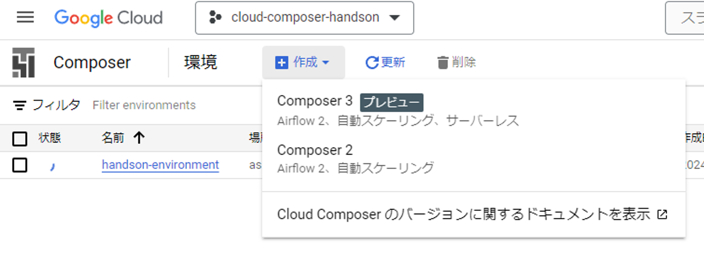
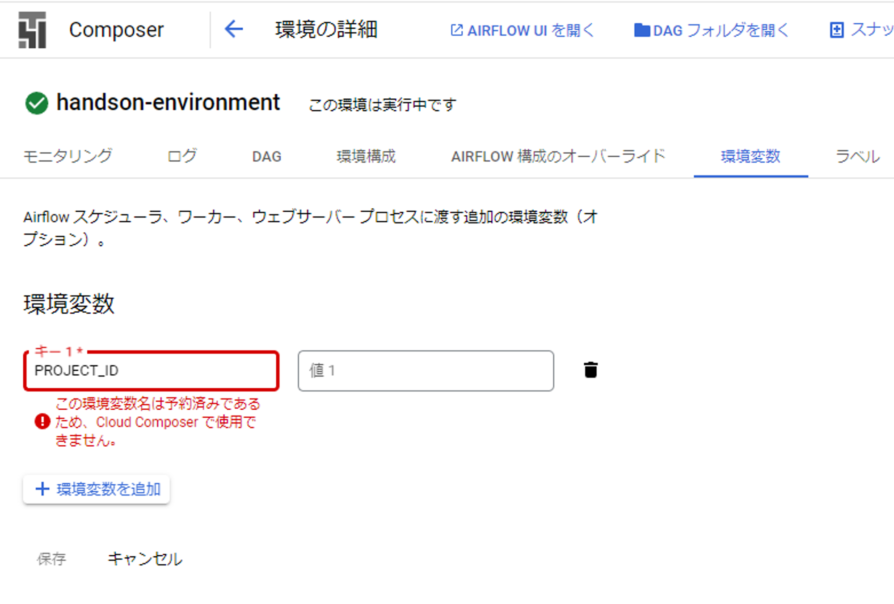

# Composerの料金について確認する

- 環境を作るだけで料金が発生する
- EC2のように何かのインスタンスを維持するっぽい
- 24時間で数ドル掛かるらしいので、環境の削除を忘れないように


# 環境を作成する




- 10分以上↓のように作成中の状態が続いた、結構待たされる


- 作成中から実行中に変わるまで20分以上かかった


# 作ったComposer環境の初期状態を確認する

- `airflow_monitoring` という名前のDAGが作られていて、10分毎に実行されている


```python
"""A liveness prober dag for monitoring composer.googleapis.com/environment/healthy."""
import airflow
from airflow import DAG
from airflow.operators.bash_operator import BashOperator
from datetime import timedelta

default_args = {
    'start_date': airflow.utils.dates.days_ago(0),
    'retries': 1,
    'retry_delay': timedelta(minutes=5)
}

dag = DAG(
    'airflow_monitoring',
    default_args=default_args,
    description='liveness monitoring dag',
    schedule_interval='*/10 * * * *',
    max_active_runs=2,
    catchup=False,
    dagrun_timeout=timedelta(minutes=10),
)

# priority_weight has type int in Airflow DB, uses the maximum.
t1 = BashOperator(
    task_id='echo',
    bash_command='echo test',
    dag=dag,
    depends_on_past=False,
    priority_weight=2**31 - 1,
    do_xcom_push=False)
```

# 書籍のチュートリアルを真似してみる

## 環境変数の設定

- `PROJECT_ID` は予約されたキーらしいので、既定の環境変数になっているっぽい


## AirflowサーバでDAGを追加する

- Composer環境からAirflowサーバを開く



- 書籍のgithubリポジトリからDAGに使うソースコードを入手
    - https://github.com/ghmagazine/gcpdataplatformbook/blob/main/ch6/count_users.py

```python
# リスト6-1. 各種Pythonモジュールのインポート
import datetime
import os

import airflow
from airflow.contrib.operators import bigquery_operator, \
    bigquery_table_delete_operator, gcs_to_bq
import pendulum

# リスト6-2. DAG内のオペレータ共通のパラメータの定義
# DAG内のオペレータ共通のパラメータを定義する。
default_args = {
    'owner': 'gcpbook',
    'depends_on_past': False,
    'email': [''],
    'email_on_failure': False,
    'email_on_retry': False,
    'retries': 1,
    'retry_delay': datetime.timedelta(minutes=5),
    # DAG作成日の午前2時(JST)を開始日時とする。
    'start_date': pendulum.today('Asia/Tokyo').add(hours=2)
}

# リスト6-3. DAGの定義
# DAGを定義する。
with airflow.DAG(
        'count_users',
        default_args=default_args,
        # 日次でDAGを実行する。
        schedule_interval=datetime.timedelta(days=1),
        catchup=False) as dag:

    # リスト6-4. ユーザ行動ログ取り込みタスクの定義
    # Cloud Storage上のユーザ行動ログをBigQueryの作業用テーブルへ
    # 取り込むタスクを定義する。
    load_events = gcs_to_bq.GoogleCloudStorageToBigQueryOperator(
        task_id='load_events',
        bucket=os.environ.get('PROJECT_ID') + '-gcpbook-ch5',
        source_objects=['data/events/{{ ds_nodash }}/*.json.gz'],
        destination_project_dataset_table='gcpbook_ch5.work_events',
        source_format='NEWLINE_DELIMITED_JSON'
    )

    # リスト6-5. gcpbook_ch5.dauテーブルへの書き込みタスクの定義
    # BigQueryの作業用テーブルとユーザ情報テーブルを結合し、課金ユーザと
    # 無課金ユーザそれぞれのユーザ数を算出して、結果をgcpbook_ch5.dau
    # テーブルへ書き込むタスクを定義する。
    insert_dau = bigquery_operator.BigQueryOperator(
        task_id='insert_dau',
        use_legacy_sql=False,
        sql="""
            insert gcpbook_ch5.dau
            select
                date('{{ ds }}') as dt
            ,   countif(u.is_paid_user) as paid_users
            ,   countif(not u.is_paid_user) as free_to_play_users
            from
                (
                    select distinct
                        user_pseudo_id
                    from
                        gcpbook_ch5.work_events
                ) e
                    inner join
                        gcpbook_ch5.users u
                    on
                        u.user_pseudo_id = e.user_pseudo_id
        """
    )

    # リスト6-6. 作業用テーブルを削除するタスクの定義
    # BigQueryの作業用テーブルを削除するタスクを定義する。
    delete_work_table = \
        bigquery_table_delete_operator.BigQueryTableDeleteOperator(
            task_id='delete_work_table',
            deletion_dataset_table='gcpbook_ch5.work_events'
        )

    # リスト6-7. タスクの依存関係の定義
    # 各タスクの依存関係を定義する。
    load_events >> insert_dau >> delete_work_table
```

- コンソールで以下を実行し、DAGを新規登録する

```python
gcloud composer environments storage dags import --environment handson-environment --location asia-northeast1 --source count_users.py
```

- 書籍のコードだとDAG Import Errorが出たのでコードを修正する必要がある？
    - `PROJECT_ID` 環境変数が取得できなかったらしいが、そもそも予約されてたからデフォルトで提供されているのかとばかり…


- 書籍で紹介している環境変数を追加するコマンドを動作確認する
    - 環境変数FOOは追加できた

```python
 gcloud composer environments update handson-environment --location asia-northeast1 --update-env-variables=FOO=foo
```


- しかし`PROJECT_ID`はやはりダメだった


- 環境変数からプロジェクトIDを取るのは諦めて一旦直書きするように修正した

```diff
    load_events = gcs_to_bq.GoogleCloudStorageToBigQueryOperator(
        task_id='load_events',
-       bucket=os.environ.get('PROJECT_ID') + '-gcpbook-ch5',
+       bucket='cloud-composer-handson-gcpbook-ch5',
        source_objects=['data/events/{{ ds_nodash }}/*.json.gz'],
        destination_project_dataset_table='gcpbook_ch5.work_events',
        source_format='NEWLINE_DELIMITED_JSON'
    )
```

- 無事、`count_users`のDAGが新規追加された


## DAGを実行する前に…

- DAGでBQデータセット化するjsonのzipファイルの所在を確認しておきたい
- どうやらこの書籍は以前の章で解説したGCPプロジェクトやリソースを再利用するらしい
- 現在CloudComposerを解説する6章を読んでおり、5章で使ったjsonのzipを再利用している
- 5章のELT/ETLでDataflowのhandsonをやった時は書籍通りにはやっていなかったのでzipファイルが無い
    - ので、5章を読み返してzipファイルを入手してみる

```diff
bq --location=asia-northeast1 extract --destination_format NEWLINE_DELIMITED_JSON --compression GZIP firebase-public-project:analytics_153293282.events_20181001 gs://cloud-composer-handson-gcpbook-ch5/data/events/20181001/*.json.gz
```

- どうやら書籍で紹介している`firebase-public-project:analytics_153293282.events_20181001` は既に存在していないらしく、jsonのzipは入手できなかった、古い書籍はここが困る


## 使用するデータを見直す

- GCSバケットのファイルを読み込んでデータテーブルが作れるよう、pythonコードでテーブルのスキーマも指定するように変更
- `work_events` と`users`テーブルはそれぞれjsonファイルとcsvファイルから作らせるように変更

```python
# リスト6-1. 各種Pythonモジュールのインポート
import datetime
import os

import airflow
from airflow.contrib.operators import bigquery_operator, \
    bigquery_table_delete_operator, gcs_to_bq
import pendulum

# リスト6-2. DAG内のオペレータ共通のパラメータの定義
# DAG内のオペレータ共通のパラメータを定義する。
default_args = {
    'owner': 'gcpbook',
    'depends_on_past': False,
    'email': [''],
    'email_on_failure': False,
    'email_on_retry': False,
    'retries': 1,
    'retry_delay': datetime.timedelta(minutes=5),
    # DAG作成日の午前2時(JST)を開始日時とする。
    'start_date': pendulum.today('Asia/Tokyo').add(hours=2)
}

# リスト6-3. DAGの定義
# DAGを定義する。
with airflow.DAG(
        'count_users',
        default_args=default_args,
        # 日次でDAGを実行する。
        schedule_interval=datetime.timedelta(days=1),
        catchup=False) as dag:

    # リスト6-4. ユーザ行動ログ取り込みタスクの定義
    # Cloud Storage上のユーザ行動ログをBigQueryの作業用テーブルへ
    # 取り込むタスクを定義する。
    # load_events = gcs_to_bq.GoogleCloudStorageToBigQueryOperator(
    #     task_id='load_events',
    #     bucket='cloud-composer-handson-gcpbook-ch5',
    #     source_objects=['data/events/{{ ds_nodash }}/*.json.gz'],
    #     destination_project_dataset_table='f"{dataset}".work_events',
    #     source_format='NEWLINE_DELIMITED_JSON'
    # )

    dataset = "handson-dataset"
    bucket = "cloud-composer-handson"

    load_events = gcs_to_bq.GoogleCloudStorageToBigQueryOperator(
        task_id='load_events',
        bucket=bucket,
        source_objects=['data/events/{{ ds_nodash }}/*.json'],
        destination_project_dataset_table=f"{dataset}.work_events",
        source_format='NEWLINE_DELIMITED_JSON',
        schema_fields=[
            {'name': 'user_pseudo_id', 'type': 'STRING', 'mode': 'REQUIRED'},
            {'name': 'event_name', 'type': 'STRING', 'mode': 'REQUIRED'},
            {'name': 'event_timestamp', 'type': 'TIMESTAMP', 'mode': 'REQUIRED'},
            {'name': 'platform', 'type': 'STRING', 'mode': 'NULLABLE'},
            {'name': 'browser', 'type': 'STRING', 'mode': 'NULLABLE'},
            {'name': 'browser_version', 'type': 'STRING', 'mode': 'NULLABLE'},
            {'name': 'os', 'type': 'STRING', 'mode': 'NULLABLE'},
            {'name': 'app_version', 'type': 'STRING', 'mode': 'NULLABLE'},
            {'name': 'product_id', 'type': 'STRING', 'mode': 'NULLABLE'},
            {'name': 'amount', 'type': 'INTEGER', 'mode': 'NULLABLE'}
        ]
    )

    # usersテーブルへのデータ読み込みタスクの定義
    load_users = gcs_to_bq.GoogleCloudStorageToBigQueryOperator(
        task_id='load_users',
        bucket=bucket,
        source_objects=['data/users/users.csv'],
        destination_project_dataset_table=f"{dataset}.users",
        source_format='CSV',
        skip_leading_rows=1,
        schema_fields=[
            {'name': 'user_pseudo_id', 'type': 'STRING', 'mode': 'REQUIRED'},
            {'name': 'is_paid_user', 'type': 'BOOLEAN', 'mode': 'REQUIRED'}
        ]
    )

    # リスト6-5. f"{dataset}".dauテーブルへの書き込みタスクの定義
    # BigQueryの作業用テーブルとユーザ情報テーブルを結合し、課金ユーザと
    # 無課金ユーザそれぞれのユーザ数を算出して、結果をf"{dataset}".dau
    # テーブルへ書き込むタスクを定義する。
    insert_dau = bigquery_operator.BigQueryOperator(
        task_id='insert_dau',
        use_legacy_sql=False,
        sql="""
            insert {dataset}.dau
            select
                date('{{ ds }}') as dt
            ,   countif(u.is_paid_user) as paid_users
            ,   countif(not u.is_paid_user) as free_to_play_users
            from
                (
                    select distinct
                        user_pseudo_id
                    from
                        {dataset}.work_events
                ) e
                    inner join
                        {dataset}.users u
                    on
                        u.user_pseudo_id = e.user_pseudo_id
        """
    )

    # リスト6-6. 作業用テーブルを削除するタスクの定義
    # BigQueryの作業用テーブルを削除するタスクを定義する。
    delete_work_table = \
        bigquery_table_delete_operator.BigQueryTableDeleteOperator(
            task_id='delete_work_table',
            deletion_dataset_table=f"{dataset}.work_events"
        )

    # リスト6-7. タスクの依存関係の定義
    # 各タスクの依存関係を定義する。
    load_events >> load_users >> insert_dau >> delete_work_table
```

```jsx
// users.csv
user_pseudo_id,is_paid_user
12345abcde,true
67890fghij,false
abcde12345,true
```

```json
// sample-data.json
[
    {
        "user_pseudo_id": "12345abcde",
        "event_name": "login",
        "event_timestamp": "2024-07-20T10:15:30Z",
        "platform": "web",
        "browser": "Chrome",
        "browser_version": "91.0.4472.124",
        "os": "Windows 10"
    },
    {
        "user_pseudo_id": "67890fghij",
        "event_name": "purchase",
        "event_timestamp": "2024-07-20T10:20:45Z",
        "platform": "mobile",
        "app_version": "1.2.3",
        "product_id": "prod_001",
        "amount": 500
    },
    {
        "user_pseudo_id": "abcde12345",
        "event_name": "logout",
        "event_timestamp": "2024-07-20T10:25:00Z",
        "platform": "web",
        "browser": "Firefox",
        "browser_version": "89.0",
        "os": "macOS Big Sur"
    },
    {
        "user_pseudo_id": "12345abcde",
        "event_name": "purchase",
        "event_timestamp": "2024-07-20T10:30:15Z",
        "platform": "web",
        "browser": "Chrome",
        "browser_version": "91.0.4472.124",
        "os": "Windows 10",
        "product_id": "prod_002",
        "amount": 300
    },
    {
        "user_pseudo_id": "67890fghij",
        "event_name": "login",
        "event_timestamp": "2024-07-20T10:35:45Z",
        "platform": "mobile",
        "app_version": "1.2.3",
        "os": "iOS 14"
    },
    {
        "user_pseudo_id": "abcde12345",
        "event_name": "purchase",
        "event_timestamp": "2024-07-20T10:40:00Z",
        "platform": "web",
        "browser": "Firefox",
        "browser_version": "89.0",
        "os": "macOS Big Sur",
        "product_id": "prod_003",
        "amount": 700
    },
    {
        "user_pseudo_id": "12345abcde",
        "event_name": "logout",
        "event_timestamp": "2024-07-20T10:45:30Z",
        "platform": "web",
        "browser": "Chrome",
        "browser_version": "91.0.4472.124",
        "os": "Windows 10"
    },
    {
        "user_pseudo_id": "67890fghij",
        "event_name": "logout",
        "event_timestamp": "2024-07-20T10:50:45Z",
        "platform": "mobile",
        "app_version": "1.2.3",
        "os": "iOS 14"
    },
    {
        "user_pseudo_id": "abcde12345",
        "event_name": "login",
        "event_timestamp": "2024-07-20T10:55:00Z",
        "platform": "web",
        "browser": "Firefox",
        "browser_version": "89.0",
        "os": "macOS Big Sur"
    }
]
```

- ファイルをGCSにアップロードし、DAGのpythonコードも更新

```python
gsutil cp users.csv gs://cloud-composer-handson/data/users/users.csv
gsutil cp sample-data.json gs://cloud-composer-handson/data/events/20181001/data.json
gcloud composer environments storage dags import --environment handson-environment --location asia-northeast1 --source count_users.py
```


## 作ったDAGの確認


- Airflow側のviewも確認してみる


```python
default-hostname
*** Reading remote logs from Cloud Logging.
[2024-07-20, 13:38:44 UTC] {taskinstance.py:1160} INFO - Dependencies all met for dep_context=non-requeueable deps ti=<TaskInstance: count_users.load_events manual__2024-07-20T13:31:23.713912Z [queued]>
[2024-07-20, 13:38:44 UTC] {taskinstance.py:1160} INFO - Dependencies all met for dep_context=requeueable deps ti=<TaskInstance: count_users.load_events manual__2024-07-20T13:31:23.713912Z [queued]>
[2024-07-20, 13:38:44 UTC] {taskinstance.py:1362} INFO - Starting attempt 2 of 2
[2024-07-20, 13:38:44 UTC] {taskinstance.py:1383} INFO - Executing <Task(GCSToBigQueryOperator): load_events> on 2024-07-20 13:31:23.713912+00:00
[2024-07-20, 13:38:44 UTC] {standard_task_runner.py:57} INFO - Started process 8218 to run task
[2024-07-20, 13:38:44 UTC] {standard_task_runner.py:84} INFO - Running: ['airflow', 'tasks', 'run', 'count_users', 'load_events', 'manual__2024-07-20T13:31:23.713912Z', '--job-id', '45', '--raw', '--subdir', 'DAGS_FOLDER/count_users.py', '--cfg-path', '/tmp/tmp3uny4u8q']
[2024-07-20, 13:38:44 UTC] {standard_task_runner.py:85} INFO - Job 45: Subtask load_events
[2024-07-20, 13:38:44 UTC] {task_command.py:422} INFO - Running <TaskInstance: count_users.load_events manual__2024-07-20T13:31:23.713912Z [running]> on host airflow-worker-x65fv
[2024-07-20, 13:38:44 UTC] {taskinstance.py:1664} INFO - Exporting env vars: AIRFLOW_CTX_DAG_EMAIL='' AIRFLOW_CTX_DAG_OWNER='gcpbook' AIRFLOW_CTX_DAG_ID='count_users' AIRFLOW_CTX_TASK_ID='load_events' AIRFLOW_CTX_EXECUTION_DATE='2024-07-20T13:31:23.713912+00:00' AIRFLOW_CTX_TRY_NUMBER='2' AIRFLOW_CTX_DAG_RUN_ID='manual__2024-07-20T13:31:23.713912Z'
[2024-07-20, 13:38:44 UTC] {connection.py:232} WARNING - Connection schemes (type: google_cloud_platform) shall not contain '_' according to RFC3986.
[2024-07-20, 13:38:44 UTC] {base.py:73} INFO - Using connection ID 'google_cloud_default' for task execution.
[2024-07-20, 13:38:44 UTC] {gcs_to_bigquery.py:381} INFO - Using existing BigQuery table for storing data...
[2024-07-20, 13:38:44 UTC] {credentials_provider.py:353} INFO - Getting connection using `google.auth.default()` since no explicit credentials are provided.
[2024-07-20, 13:38:44 UTC] {bigquery.py:2385} INFO - Project is not included in destination_project_dataset_table: handson-dataset.work_events; using project "cloud-composer-handson"
[2024-07-20, 13:38:44 UTC] {gcs_to_bigquery.py:385} INFO - Executing: {'load': {'autodetect': True, 'createDisposition': 'CREATE_IF_NEEDED', 'destinationTable': {'projectId': 'cloud-composer-handson', 'datasetId': 'handson-dataset', 'tableId': 'work_events'}, 'sourceFormat': 'NEWLINE_DELIMITED_JSON', 'sourceUris': ['gs://cloud-composer-handson/data/events/20181001/*.json'], 'writeDisposition': 'WRITE_EMPTY', 'ignoreUnknownValues': False, 'schema': {'fields': [{'name': 'user_pseudo_id', 'type': 'STRING', 'mode': 'REQUIRED'}, {'name': 'event_name', 'type': 'STRING', 'mode': 'REQUIRED'}, {'name': 'event_timestamp', 'type': 'TIMESTAMP', 'mode': 'REQUIRED'}, {'name': 'platform', 'type': 'STRING', 'mode': 'NULLABLE'}, {'name': 'browser', 'type': 'STRING', 'mode': 'NULLABLE'}, {'name': 'browser_version', 'type': 'STRING', 'mode': 'NULLABLE'}, {'name': 'os', 'type': 'STRING', 'mode': 'NULLABLE'}, {'name': 'app_version', 'type': 'STRING', 'mode': 'NULLABLE'}, {'name': 'product_id', 'type': 'STRING', 'mode': 'NULLABLE'}, {'name': 'amount', 'type': 'INTEGER', 'mode': 'NULLABLE'}]}}}
[2024-07-20, 13:38:44 UTC] {bigquery.py:1670} INFO - Inserting job airflow_count_users_load_events_2024_07_20T13_31_23_713912_00_00_364296d8c36e6aee7194e245742db5dd
[2024-07-20, 13:38:45 UTC] {taskinstance.py:1939} ERROR - Task failed with exception\nTraceback (most recent call last):\n  File "/opt/python3.11/lib/python3.11/site-packages/airflow/providers/google/cloud/transfers/gcs_to_bigquery.py", line 386, in execute\n    job: BigQueryJob | UnknownJob = self._submit_job(self.hook, job_id)\n                                    ^^^^^^^^^^^^^^^^^^^^^^^^^^^^^^^^^^^\n  File "/opt/python3.11/lib/python3.11/site-packages/airflow/providers/google/cloud/transfers/gcs_to_bigquery.py", line 308, in _submit_job\n    return hook.insert_job(\n           ^^^^^^^^^^^^^^^^\n  File "/opt/python3.11/lib/python3.11/site-packages/airflow/providers/google/common/hooks/base_google.py", line 524, in inner_wrapper\n    return func(self, *args, **kwargs)\n           ^^^^^^^^^^^^^^^^^^^^^^^^^^^\n  File "/opt/python3.11/lib/python3.11/site-packages/airflow/providers/google/cloud/hooks/bigquery.py", line 1673, in insert_job\n    job_api_repr._begin()\n  File "/opt/python3.11/lib/python3.11/site-packages/google/cloud/bigquery/job/base.py", line 740, in _begin\n    api_response = client._call_api(\n                   ^^^^^^^^^^^^^^^^^\n  File "/opt/python3.11/lib/python3.11/site-packages/google/cloud/bigquery/client.py", line 831, in _call_api\n    return call()\n           ^^^^^^\n  File "/opt/python3.11/lib/python3.11/site-packages/google/api_core/retry/retry_unary.py", line 293, in retry_wrapped_func\n    return retry_target(\n           ^^^^^^^^^^^^^\n  File "/opt/python3.11/lib/python3.11/site-packages/google/api_core/retry/retry_unary.py", line 153, in retry_target\n    _retry_error_helper(\n  File "/opt/python3.11/lib/python3.11/site-packages/google/api_core/retry/retry_base.py", line 212, in _retry_error_helper\n    raise final_exc from source_exc\n  File "/opt/python3.11/lib/python3.11/site-packages/google/api_core/retry/retry_unary.py", line 144, in retry_target\n    result = target()\n             ^^^^^^^^\n  File "/opt/python3.11/lib/python3.11/site-packages/google/cloud/_http/__init__.py", line 494, in api_request\n    raise exceptions.from_http_response(response)\ngoogle.api_core.exceptions.NotFound: 404 POST https://bigquery.googleapis.com/bigquery/v2/projects/cloud-composer-handson/jobs?prettyPrint=false: Not found: Dataset cloud-composer-handson:handson-dataset
[2024-07-20, 13:38:45 UTC] {taskinstance.py:1401} INFO - Marking task as FAILED. dag_id=count_users, task_id=load_events, execution_date=20240720T133123, start_date=20240720T133844, end_date=20240720T133845
[2024-07-20, 13:38:45 UTC] {standard_task_runner.py:104} ERROR - Failed to execute job 45 for task load_events (404 POST https://bigquery.googleapis.com/bigquery/v2/projects/cloud-composer-handson/jobs?prettyPrint=false: Not found: Dataset cloud-composer-handson:handson-dataset; 8218)
[2024-07-20, 13:38:45 UTC] {local_task_job_runner.py:228} INFO - Task exited with return code 1
[2024-07-20, 13:38:45 UTC] {warnings.py:110} WARNING - /opt/python3.11/lib/python3.11/site-packages/airflow/models/baseoperator.py:1215: AirflowProviderDeprecationWarning: Call to deprecated class BigQueryExecuteQueryOperator. (This operator is deprecated. Please use `BigQueryInsertJobOperator`.)\n  result = cls.__new__(cls)\n
[2024-07-20, 13:38:45 UTC] {taskinstance.py:2781} INFO - 0 downstream tasks scheduled from follow-on schedule check
```

## DAGのpythonコードを修正してやり直してみる

- BQデータセットは予め作っておく
    - テーブルは生成できてもデータセットは無理かも
    - データセット名にハイフンは使えなかったのでアンダースコアに置き換える

```python
# リスト6-1. 各種Pythonモジュールのインポート
import datetime
import os

import airflow
from airflow.contrib.operators import bigquery_operator, \
    bigquery_table_delete_operator, gcs_to_bq
import pendulum

# リスト6-2. DAG内のオペレータ共通のパラメータの定義
# DAG内のオペレータ共通のパラメータを定義する。
default_args = {
    'owner': 'gcpbook',
    'depends_on_past': False,
    'email': [''],
    'email_on_failure': False,
    'email_on_retry': False,
    'retries': 1,
    'retry_delay': datetime.timedelta(minutes=5),
    # DAG作成日の午前2時(JST)を開始日時とする。
    'start_date': pendulum.today('Asia/Tokyo').add(hours=2)
}

# リスト6-3. DAGの定義
# DAGを定義する。
with airflow.DAG(
        'count_users',
        default_args=default_args,
        # 日次でDAGを実行する。
        schedule_interval=datetime.timedelta(days=1),
        catchup=False) as dag:

    # リスト6-4. ユーザ行動ログ取り込みタスクの定義
    # Cloud Storage上のユーザ行動ログをBigQueryの作業用テーブルへ
    # 取り込むタスクを定義する。
    # load_events = gcs_to_bq.GoogleCloudStorageToBigQueryOperator(
    #     task_id='load_events',
    #     bucket='cloud-composer-handson-gcpbook-ch5',
    #     source_objects=['data/events/{{ ds_nodash }}/*.json.gz'],
    #     destination_project_dataset_table='f"{dataset}".work_events',
    #     source_format='NEWLINE_DELIMITED_JSON'
    # )

    dataset = "handson_dataset"
    bucket = "cloud-composer-handson"

    load_events = gcs_to_bq.GoogleCloudStorageToBigQueryOperator(
        task_id='load_events',
        bucket=bucket,
        source_objects=['data/events/20181001/*.json'],
        destination_project_dataset_table=f"{dataset}.work_events",
        source_format='NEWLINE_DELIMITED_JSON',
        schema_fields=[
            {'name': 'user_pseudo_id', 'type': 'STRING', 'mode': 'REQUIRED'},
            {'name': 'event_name', 'type': 'STRING', 'mode': 'REQUIRED'},
            {'name': 'event_timestamp', 'type': 'TIMESTAMP', 'mode': 'REQUIRED'},
            {'name': 'platform', 'type': 'STRING', 'mode': 'NULLABLE'},
            {'name': 'browser', 'type': 'STRING', 'mode': 'NULLABLE'},
            {'name': 'browser_version', 'type': 'STRING', 'mode': 'NULLABLE'},
            {'name': 'os', 'type': 'STRING', 'mode': 'NULLABLE'},
            {'name': 'app_version', 'type': 'STRING', 'mode': 'NULLABLE'},
            {'name': 'product_id', 'type': 'STRING', 'mode': 'NULLABLE'},
            {'name': 'amount', 'type': 'INTEGER', 'mode': 'NULLABLE'}
        ]
    )

    # usersテーブルへのデータ読み込みタスクの定義
    load_users = gcs_to_bq.GoogleCloudStorageToBigQueryOperator(
        task_id='load_users',
        bucket=bucket,
        source_objects=['data/users/users.csv'],
        destination_project_dataset_table=f"{dataset}.users",
        source_format='CSV',
        skip_leading_rows=1,
        schema_fields=[
            {'name': 'user_pseudo_id', 'type': 'STRING', 'mode': 'REQUIRED'},
            {'name': 'is_paid_user', 'type': 'BOOLEAN', 'mode': 'REQUIRED'}
        ]
    )

    # リスト6-5. f"{dataset}".dauテーブルへの書き込みタスクの定義
    # BigQueryの作業用テーブルとユーザ情報テーブルを結合し、課金ユーザと
    # 無課金ユーザそれぞれのユーザ数を算出して、結果をf"{dataset}".dau
    # テーブルへ書き込むタスクを定義する。
    insert_dau = bigquery_operator.BigQueryOperator(
        task_id='insert_dau',
        use_legacy_sql=False,
        sql="""
            insert {dataset}.dau
            select
                date('{{ ds }}') as dt
            ,   countif(u.is_paid_user) as paid_users
            ,   countif(not u.is_paid_user) as free_to_play_users
            from
                (
                    select distinct
                        user_pseudo_id
                    from
                        {dataset}.work_events
                ) e
                    inner join
                        {dataset}.users u
                    on
                        u.user_pseudo_id = e.user_pseudo_id
        """
    )

    # リスト6-6. 作業用テーブルを削除するタスクの定義
    # BigQueryの作業用テーブルを削除するタスクを定義する。
    delete_work_table = \
        bigquery_table_delete_operator.BigQueryTableDeleteOperator(
            task_id='delete_work_table',
            deletion_dataset_table=f"{dataset}.work_events"
        )

    # リスト6-7. タスクの依存関係の定義
    # 各タスクの依存関係を定義する。
    load_events >> load_users >> insert_dau >> delete_work_table
```

```python
default-hostname
*** Reading remote logs from Cloud Logging.
[2024-07-20, 13:43:42 UTC] {taskinstance.py:1160} INFO - Dependencies all met for dep_context=non-requeueable deps ti=<TaskInstance: count_users.load_events manual__2024-07-20T13:43:11.035688Z [queued]>
[2024-07-20, 13:43:42 UTC] {taskinstance.py:1160} INFO - Dependencies all met for dep_context=requeueable deps ti=<TaskInstance: count_users.load_events manual__2024-07-20T13:43:11.035688Z [queued]>
[2024-07-20, 13:43:42 UTC] {taskinstance.py:1362} INFO - Starting attempt 1 of 2
[2024-07-20, 13:43:42 UTC] {taskinstance.py:1383} INFO - Executing <Task(GCSToBigQueryOperator): load_events> on 2024-07-20 13:43:11.035688+00:00
[2024-07-20, 13:43:42 UTC] {standard_task_runner.py:57} INFO - Started process 8305 to run task
[2024-07-20, 13:43:42 UTC] {standard_task_runner.py:84} INFO - Running: ['airflow', 'tasks', 'run', 'count_users', 'load_events', 'manual__2024-07-20T13:43:11.035688Z', '--job-id', '47', '--raw', '--subdir', 'DAGS_FOLDER/count_users.py', '--cfg-path', '/tmp/tmp8l9zm270']
[2024-07-20, 13:43:42 UTC] {standard_task_runner.py:85} INFO - Job 47: Subtask load_events
[2024-07-20, 13:43:42 UTC] {task_command.py:422} INFO - Running <TaskInstance: count_users.load_events manual__2024-07-20T13:43:11.035688Z [running]> on host airflow-worker-x65fv
[2024-07-20, 13:43:42 UTC] {taskinstance.py:1664} INFO - Exporting env vars: AIRFLOW_CTX_DAG_EMAIL='' AIRFLOW_CTX_DAG_OWNER='gcpbook' AIRFLOW_CTX_DAG_ID='count_users' AIRFLOW_CTX_TASK_ID='load_events' AIRFLOW_CTX_EXECUTION_DATE='2024-07-20T13:43:11.035688+00:00' AIRFLOW_CTX_TRY_NUMBER='1' AIRFLOW_CTX_DAG_RUN_ID='manual__2024-07-20T13:43:11.035688Z'
[2024-07-20, 13:43:42 UTC] {connection.py:232} WARNING - Connection schemes (type: google_cloud_platform) shall not contain '_' according to RFC3986.
[2024-07-20, 13:43:42 UTC] {base.py:73} INFO - Using connection ID 'google_cloud_default' for task execution.
[2024-07-20, 13:43:42 UTC] {gcs_to_bigquery.py:381} INFO - Using existing BigQuery table for storing data...
[2024-07-20, 13:43:42 UTC] {credentials_provider.py:353} INFO - Getting connection using `google.auth.default()` since no explicit credentials are provided.
[2024-07-20, 13:43:42 UTC] {bigquery.py:2385} INFO - Project is not included in destination_project_dataset_table: handson_dataset.work_events; using project "cloud-composer-handson"
[2024-07-20, 13:43:42 UTC] {gcs_to_bigquery.py:385} INFO - Executing: {'load': {'autodetect': True, 'createDisposition': 'CREATE_IF_NEEDED', 'destinationTable': {'projectId': 'cloud-composer-handson', 'datasetId': 'handson_dataset', 'tableId': 'work_events'}, 'sourceFormat': 'NEWLINE_DELIMITED_JSON', 'sourceUris': ['gs://cloud-composer-handson/data/events/20181001/*.json'], 'writeDisposition': 'WRITE_EMPTY', 'ignoreUnknownValues': False, 'schema': {'fields': [{'name': 'user_pseudo_id', 'type': 'STRING', 'mode': 'REQUIRED'}, {'name': 'event_name', 'type': 'STRING', 'mode': 'REQUIRED'}, {'name': 'event_timestamp', 'type': 'TIMESTAMP', 'mode': 'REQUIRED'}, {'name': 'platform', 'type': 'STRING', 'mode': 'NULLABLE'}, {'name': 'browser', 'type': 'STRING', 'mode': 'NULLABLE'}, {'name': 'browser_version', 'type': 'STRING', 'mode': 'NULLABLE'}, {'name': 'os', 'type': 'STRING', 'mode': 'NULLABLE'}, {'name': 'app_version', 'type': 'STRING', 'mode': 'NULLABLE'}, {'name': 'product_id', 'type': 'STRING', 'mode': 'NULLABLE'}, {'name': 'amount', 'type': 'INTEGER', 'mode': 'NULLABLE'}]}}}
[2024-07-20, 13:43:42 UTC] {bigquery.py:1670} INFO - Inserting job airflow_count_users_load_events_2024_07_20T13_43_11_035688_00_00_f9dd66515044f29f603ec99411b40022
[2024-07-20, 13:43:43 UTC] {taskinstance.py:1939} ERROR - Task failed with exception\nTraceback (most recent call last):\n  File "/opt/python3.11/lib/python3.11/site-packages/airflow/providers/google/cloud/transfers/gcs_to_bigquery.py", line 446, in execute\n    job.result(timeout=self.result_timeout, retry=self.result_retry)\n  File "/opt/python3.11/lib/python3.11/site-packages/google/cloud/bigquery/job/base.py", line 971, in result\n    return super(_AsyncJob, self).result(timeout=timeout, **kwargs)\n           ^^^^^^^^^^^^^^^^^^^^^^^^^^^^^^^^^^^^^^^^^^^^^^^^^^^^^^^^\n  File "/opt/python3.11/lib/python3.11/site-packages/google/api_core/future/polling.py", line 261, in result\n    raise self._exception\ngoogle.api_core.exceptions.BadRequest: 400 Error while reading data, error message: Failed to parse JSON: No object found when new array is started.; BeginArray returned false File: data.json; reason: invalid, location: data.json, message: Error while reading data, error message: Failed to parse JSON: No object found when new array is started.; BeginArray returned false File: data.json
[2024-07-20, 13:43:43 UTC] {taskinstance.py:1401} INFO - Marking task as UP_FOR_RETRY. dag_id=count_users, task_id=load_events, execution_date=20240720T134311, start_date=20240720T134342, end_date=20240720T134343
[2024-07-20, 13:43:43 UTC] {standard_task_runner.py:104} ERROR - Failed to execute job 47 for task load_events (400 Error while reading data, error message: Failed to parse JSON: No object found when new array is started.; BeginArray returned false File: data.json; reason: invalid, location: data.json, message: Error while reading data, error message: Failed to parse JSON: No object found when new array is started.; BeginArray returned false File: data.json; 8305)
[2024-07-20, 13:43:43 UTC] {local_task_job_runner.py:228} INFO - Task exited with return code 1
[2024-07-20, 13:43:43 UTC] {warnings.py:110} WARNING - /opt/python3.11/lib/python3.11/site-packages/airflow/models/baseoperator.py:1215: AirflowProviderDeprecationWarning: Call to deprecated class BigQueryExecuteQueryOperator. (This operator is deprecated. Please use `BigQueryInsertJobOperator`.)\n  result = cls.__new__(cls)\n
[2024-07-20, 13:43:43 UTC] {taskinstance.py:2781} INFO - 0 downstream tasks scheduled from follow-on schedule check
```

- events.csvのloadでエラーが出ているっぽいので余分なデータを落とし、テーブルのスキーマもシンプルにする

```python
user_pseudo_id,event_name,event_timestamp
12345abcde,login,2024-07-20T10:15:30Z
67890fghij,purchase,2024-07-20T10:20:45Z
abcde12345,logout,2024-07-20T10:25:00Z
12345abcde,purchase,2024-07-20T10:30:15Z
67890fghij,login,2024-07-20T10:35:45Z
abcde12345,purchase,2024-07-20T10:40:00Z
12345abcde,logout,2024-07-20T10:45:30Z
67890fghij,logout,2024-07-20T10:50:45Z
abcde12345,login,2024-07-20T10:55:00Z
```

```python
    load_events = gcs_to_bq.GoogleCloudStorageToBigQueryOperator(
        task_id='load_events',
        bucket=bucket,
        source_objects=['data/events/20181001/events.csv'],
        destination_project_dataset_table=f"{dataset}.work_events",
        source_format='CSV',
        skip_leading_rows=1,
        schema_fields=[
            {'name': 'user_pseudo_id', 'type': 'STRING', 'mode': 'REQUIRED'},
            {'name': 'event_name', 'type': 'STRING', 'mode': 'REQUIRED'},
            {'name': 'event_timestamp', 'type': 'TIMESTAMP', 'mode': 'REQUIRED'}
        ]
    )
```

- csvのloadは成功するようになったが、insert_dauで止まる


- insert_dauのログを確認

```python
default-hostname
*** Reading remote logs from Cloud Logging.
[2024-07-20, 14:02:34 UTC] {taskinstance.py:1160} INFO - Dependencies all met for dep_context=non-requeueable deps ti=<TaskInstance: count_users.insert_dau manual__2024-07-20T13:54:06.325249Z [queued]>
[2024-07-20, 14:02:34 UTC] {taskinstance.py:1160} INFO - Dependencies all met for dep_context=requeueable deps ti=<TaskInstance: count_users.insert_dau manual__2024-07-20T13:54:06.325249Z [queued]>
[2024-07-20, 14:02:34 UTC] {taskinstance.py:1362} INFO - Starting attempt 1 of 2
[2024-07-20, 14:02:34 UTC] {taskinstance.py:1383} INFO - Executing <Task(BigQueryExecuteQueryOperator): insert_dau> on 2024-07-20 13:54:06.325249+00:00
[2024-07-20, 14:02:34 UTC] {standard_task_runner.py:57} INFO - Started process 8621 to run task
[2024-07-20, 14:02:34 UTC] {standard_task_runner.py:84} INFO - Running: ['airflow', 'tasks', 'run', 'count_users', 'insert_dau', 'manual__2024-07-20T13:54:06.325249Z', '--job-id', '55', '--raw', '--subdir', 'DAGS_FOLDER/count_users.py', '--cfg-path', '/tmp/tmpj4ai46pk']
[2024-07-20, 14:02:34 UTC] {standard_task_runner.py:85} INFO - Job 55: Subtask insert_dau
[2024-07-20, 14:02:34 UTC] {task_command.py:422} INFO - Running <TaskInstance: count_users.insert_dau manual__2024-07-20T13:54:06.325249Z [running]> on host airflow-worker-x65fv
[2024-07-20, 14:02:34 UTC] {taskinstance.py:1664} INFO - Exporting env vars: AIRFLOW_CTX_DAG_EMAIL='' AIRFLOW_CTX_DAG_OWNER='gcpbook' AIRFLOW_CTX_DAG_ID='count_users' AIRFLOW_CTX_TASK_ID='insert_dau' AIRFLOW_CTX_EXECUTION_DATE='2024-07-20T13:54:06.325249+00:00' AIRFLOW_CTX_TRY_NUMBER='1' AIRFLOW_CTX_DAG_RUN_ID='manual__2024-07-20T13:54:06.325249Z'
[2024-07-20, 14:02:34 UTC] {bigquery.py:1353} INFO - Executing: \n            insert {dataset}.dau\n            select\n                date('2024-07-20') as dt\n            ,   countif(u.is_paid_user) as paid_users\n            ,   countif(not u.is_paid_user) as free_to_play_users\n            from\n                (\n                    select distinct\n                        user_pseudo_id\n                    from\n                        {dataset}.work_events\n                ) e\n                    inner join\n                        {dataset}.users u\n                    on\n                        u.user_pseudo_id = e.user_pseudo_id\n        
[2024-07-20, 14:02:34 UTC] {connection.py:232} WARNING - Connection schemes (type: google_cloud_platform) shall not contain '_' according to RFC3986.
[2024-07-20, 14:02:34 UTC] {base.py:73} INFO - Using connection ID 'google_cloud_default' for task execution.
[2024-07-20, 14:02:34 UTC] {warnings.py:110} WARNING - /opt/python3.11/lib/python3.11/site-packages/airflow/providers/google/cloud/operators/bigquery.py:1362: AirflowProviderDeprecationWarning: Call to deprecated method run_query. (Please use `airflow.providers.google.cloud.hooks.bigquery.BigQueryHook.insert_job`)\n  self.job_id = self.hook.run_query(\n
[2024-07-20, 14:02:34 UTC] {credentials_provider.py:353} INFO - Getting connection using `google.auth.default()` since no explicit credentials are provided.
[2024-07-20, 14:02:34 UTC] {bigquery.py:1670} INFO - Inserting job airflow_1721484154690360_b494994ddadd16371d1521ad41ec72c1
[2024-07-20, 14:02:35 UTC] {taskinstance.py:1939} ERROR - Task failed with exception\nTraceback (most recent call last):\n  File "/opt/python3.11/lib/python3.11/site-packages/airflow/providers/google/cloud/operators/bigquery.py", line 1362, in execute\n    self.job_id = self.hook.run_query(\n                  ^^^^^^^^^^^^^^^^^^^^\n  File "/opt/python3.11/lib/python3.11/site-packages/deprecated/classic.py", line 285, in wrapper_function\n    return wrapped_(*args_, **kwargs_)\n           ^^^^^^^^^^^^^^^^^^^^^^^^^^^\n  File "/opt/python3.11/lib/python3.11/site-packages/airflow/providers/google/cloud/hooks/bigquery.py", line 2315, in run_query\n    job = self.insert_job(configuration=configuration, project_id=self.project_id, location=location)\n          ^^^^^^^^^^^^^^^^^^^^^^^^^^^^^^^^^^^^^^^^^^^^^^^^^^^^^^^^^^^^^^^^^^^^^^^^^^^^^^^^^^^^^^^^^^^\n  File "/opt/python3.11/lib/python3.11/site-packages/airflow/providers/google/common/hooks/base_google.py", line 524, in inner_wrapper\n    return func(self, *args, **kwargs)\n           ^^^^^^^^^^^^^^^^^^^^^^^^^^^\n  File "/opt/python3.11/lib/python3.11/site-packages/airflow/providers/google/cloud/hooks/bigquery.py", line 1676, in insert_job\n    job_api_repr.result(timeout=timeout, retry=retry)\n  File "/opt/python3.11/lib/python3.11/site-packages/google/cloud/bigquery/job/query.py", line 1590, in result\n    do_get_result()\n  File "/opt/python3.11/lib/python3.11/site-packages/google/cloud/bigquery/job/query.py", line 1579, in do_get_result\n    super(QueryJob, self).result(retry=retry, timeout=timeout)\n  File "/opt/python3.11/lib/python3.11/site-packages/google/cloud/bigquery/job/base.py", line 971, in result\n    return super(_AsyncJob, self).result(timeout=timeout, **kwargs)\n           ^^^^^^^^^^^^^^^^^^^^^^^^^^^^^^^^^^^^^^^^^^^^^^^^^^^^^^^^\n  File "/opt/python3.11/lib/python3.11/site-packages/google/api_core/future/polling.py", line 261, in result\n    raise self._exception\ngoogle.api_core.exceptions.BadRequest: 400 Syntax error: Unexpected "{" at [2:20]; reason: invalidQuery, location: query, message: Syntax error: Unexpected "{" at [2:20]\n\nLocation: US\nJob ID: airflow_1721484154690360_b494994ddadd16371d1521ad41ec72c1\n
[2024-07-20, 14:02:35 UTC] {taskinstance.py:1401} INFO - Marking task as UP_FOR_RETRY. dag_id=count_users, task_id=insert_dau, execution_date=20240720T135406, start_date=20240720T140234, end_date=20240720T140235
[2024-07-20, 14:02:35 UTC] {standard_task_runner.py:104} ERROR - Failed to execute job 55 for task insert_dau (400 Syntax error: Unexpected "{" at [2:20]; reason: invalidQuery, location: query, message: Syntax error: Unexpected "{" at [2:20]\n\nLocation: US\nJob ID: airflow_1721484154690360_b494994ddadd16371d1521ad41ec72c1\n; 8621)
[2024-07-20, 14:02:35 UTC] {local_task_job_runner.py:228} INFO - Task exited with return code 1
[2024-07-20, 14:02:35 UTC] {warnings.py:110} WARNING - /opt/python3.11/lib/python3.11/site-packages/airflow/models/baseoperator.py:1215: AirflowProviderDeprecationWarning: Call to deprecated class BigQueryExecuteQueryOperator. (This operator is deprecated. Please use `BigQueryInsertJobOperator`.)\n  result = cls.__new__(cls)\n
[2024-07-20, 14:02:35 UTC] {taskinstance.py:2781} INFO - 0 downstream tasks scheduled from follow-on schedule check
```

- SQLクエリへのデータセット名の埋め込みにf文字列を使っていたが、これとAirflow変数である`{{ds}}` が競合していて不正なクエリになってしまっていた
    - ので、以下のようにf文字列をやめてデータセット名を直接記述した

```python
    insert_dau = bigquery_operator.BigQueryOperator(
        task_id='insert_dau',
        use_legacy_sql=False,
        sql="""
            insert handson_dataset.dau
            select
                date('{{ ds }}') as dt
            ,   countif(u.is_paid_user) as paid_users
            ,   countif(not u.is_paid_user) as free_to_play_users
            from
                (
                    select distinct
                        user_pseudo_id
                    from
                        handson_dataset.work_events
                ) e
                    inner join
                        handson_dataset.users u
                    on
                        u.user_pseudo_id = e.user_pseudo_id
        """
    )
```

# DAGの成功を確認

- Composerコンソール上でDAGが最後まで成功したことが確認できた


- Airflow上でも以下のように確認できた


- BQデータセット上でも、最終的な`insert_dau` の対象である`dau` テーブルに計算した結果が挿入されていることが確認できた


# Composer環境の削除

- 放置すると料金が加速するので忘れずに環境ごと削除すること


# 料金の確認

- 6時間ほど試行錯誤しただけで$4弱になった
- pythonコードやBQのSQLで扱うデータ量はとても小さいが、DAGの起動/中断を試行錯誤しながら繰り返すだけでこれくらい掛かることがわかった

